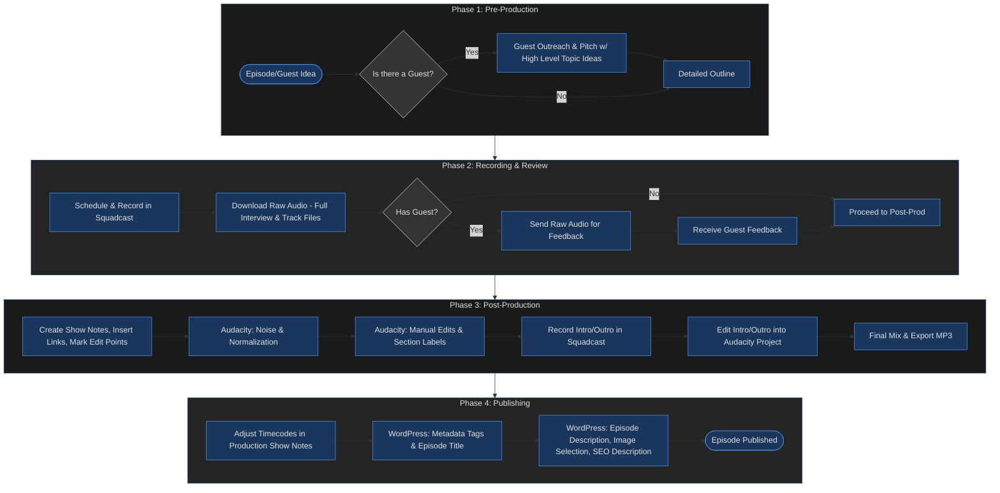

```mermaid
    info
```

## Mermaid Test

```mermaid
flowchart TD
    %% Global Styling
    accTitle: Original Podcast Workflow
    accDescr: A flow chart showing the manual process from idea to publication.

    %% Phase 1: Pre-Production
    subgraph Phase1 [Phase 1: Pre-Production]
    direction LR
        A1([Episode/Guest Idea]) --> B1{Is there a Guest?}
        B1 -- Yes --> C1[Guest Outreach & Pitch w/ High Level Topic Ideas]
        C1 --> D1[Detailed Outline]
        B1 -- No --> D1
    end

    %% Phase 2: Recording & Review
    subgraph Phase2 [Phase 2: Recording & Review]
    direction LR
        F1[Schedule & Record in Squadcast] --> G1[Download Raw Audio - Full Interview & Track Files]
        G1 --> H1{Has Guest?}
        H1 -- Yes --> I1[Send Raw Audio for Feedback]
        I1 --> J1[Receive Guest Feedback]
        H1 -- No --> K1[Proceed to Post-Prod]
        J1 --> K1
    end

    %% Phase 3: Post-Production
    subgraph Phase3 [Phase 3: Post-Production]
    direction LR
        L1[Create Show Notes, Insert Links, Mark Edit Points] --> M1[Audacity: Noise & Normalization]
        M1 --> N1[Audacity: Manual Edits & Section Labels]
        N1 --> O1[Record Intro/Outro in Squadcast]
        O1 --> P1[Edit Intro/Outro into Audacity Project]
        P1 --> Q1[Final Mix & Export MP3]
    end

    %% Phase 4: Publishing
    subgraph Phase4 [Phase 4: Publishing]
    direction LR
        R1[Adjust Timecodes in Production Show Notes] --> S1[WordPress: Metadata Tags & Episode Title]
        S1 --> T1[WordPress: Episode Description, Image Selection, SEO Description]
        T1 --> U1([Episode Published])
    end

    %% Vertical Connections between phases
    Phase1 --> Phase2
    Phase2 --> Phase3
    Phase3 --> Phase4

    %% Styles and Colors
    style Phase1 fill:#1A1A1A,stroke:#1B365D,color:#E0E0E0
    style Phase2 fill:#242424,stroke:#1B365D,color:#E0E0E0
    style Phase3 fill:#1A1A1A,stroke:#1B365D,color:#E0E0E0
    style Phase4 fill:#242424,stroke:#1B365D,color:#E0E0E0

    classDef default fill:#1B365D,stroke:#4A90E2,color:#E0E0E0
    classDef decision fill:#333333,stroke:#E0E0E0,color:#E0E0E0
    class B1,H1 decision
``` 